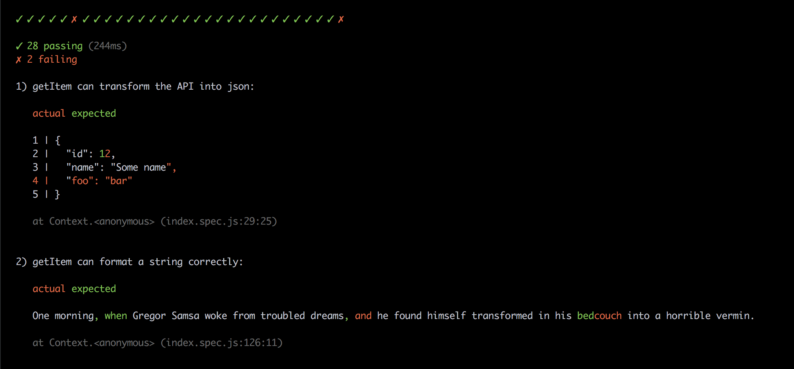

# generic-checkmark-reporter

[](http://unmaintained.tech/)

Test reporter that prints small but useful results to console.
Keeps the output consistent across different testing frameworks.
Supports diffing and smart error messages.



## Usage

- **Karma**: https://github.com/queicherius/karma-checkmark-reporter
- **Mocha**: https://github.com/queicherius/mocha-checkmark-reporter

## API

```js
var genericReporter = require('generic-checkmark-reporter')

// Function to call at the start of the test run, with an
// optional output function (defaults to process.stdout.write)
genericReporter.start(outputFunction)

// Function to call to report a single spec result
// Type: success, failure, skipped
// Error: error object given back by the test framework (e.g. AssertionError)
genericReporter.result(type, error)

// Function to call to report end results
genericReporter.end()
```

## Licence

MIT
